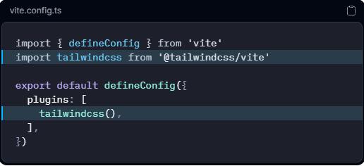

# Tailwind

## Khi nào nên dùng

### CND

- Hãy sử dụng Play CDN để thử Tailwind ngay trên trình duyệt mà không cần bất kỳ bước biên dịch nào. Play CDN được thiết kế chỉ dành cho mục đích phát triển và không dành cho môi trường sản xuất.
  []

### Tailwind CLI

- Cách đơn giản và nhanh nhất để bắt đầu sử dụng Tailwind CSS từ đầu là dùng công cụ CLI của Tailwind. CLI cũng có sẵn dưới dạng tệp thực thi độc lập nếu bạn muốn sử dụng nó mà không cần cài đặt Node.js.
- Các bước:
  - 01 Cài đặt Tailwind CSS: Cài đặt `tailwindcss` thông `@tailwindcss/cli` qua npm.
    [npm install tailwindcss @tailwindcss/cli]
  - 02 Nhập Tailwind vào CSS của bạn: Thêm đoạn `@import "tailwindcss"`;mã import vào tệp CSS chính của bạn.
    [@import "tailwindcss";]
  - 03 Bắt đầu quy trình xây dựng Tailwind CLI: Chạy công cụ CLI để quét các tệp nguồn của bạn tìm các lớp và xây dựng CSS.
    [npx @tailwindcss/cli -i ./src/input.css -o ./src/output.css --watch]
  - 04 Hãy bắt đầu sử dụng Tailwind trong HTML của bạn: Thêm tệp CSS đã biên dịch của bạn vào <head>và bắt đầu sử dụng các lớp tiện ích của Tailwind để tạo kiểu cho nội dung của bạn.
    [<link href="./output.css" rel="stylesheet">]

### Use Vite(khi dùng reactjs)

- Cài đặt Tailwind CSS như một plugin của Vite là cách liền mạch nhất để tích hợp nó với các framework như Laravel, SvelteKit, React Router, Nuxt và SolidJS.
- Các bước:
  - 01 Tạo dự án của bạn: Hãy bắt đầu bằng cách tạo một dự án Vite mới nếu bạn chưa có dự án nào. Cách phổ biến nhất là sử dụng chức năng Tạo Vite .
    [npm create vite@latest my-project
    cd my-project]
  - 02 Cài đặt Tailwind CSS: Cài đặt `tailwindcss` thông `@tailwindcss/vite` qua npm.
    [npm install tailwindcss @tailwindcss/vite]
  - 03 Cấu hình plugin Vite: Thêm `@tailwindcss/viteplugin` này vào cấu hình Vite của bạn.
    []
  - 04 Nhập CSS của Tailwind: Thêm thẻ `<meta>` @importvào tệp CSS của bạn để nhập Tailwind CSS.
    [@import "tailwindcss";]
  - 05 Bắt đầu quá trình xây dựng của bạn: Chạy quy trình biên dịch của bạn bằng lệnh `npm run dev` hoặc bất kỳ lệnh nào được cấu hình trong tệp của bạn. `package.json`
  - 06 Hãy bắt đầu sử dụng Tailwind trong HTML của bạn: Hãy đảm bảo rằng CSS đã biên dịch của bạn được bao gồm trong <head> (khung làm việc của bạn có thể tự động xử lý việc này) , sau đó bắt đầu sử dụng các lớp tiện ích của Tailwind để tạo kiểu cho nội dung của bạn.
    [<link href="/src/style.css" rel="stylesheet">]

## Học theo thứ tự ưu tiên

- Layout & Box Model: flex, grid, padding, margin, width/height.
- Typography: text-size, font-weight, leading (line-height).
- Responsive Design: Học cách dùng các tiền tố sm:, md:, lg:. Tailwind mặc định là Mobile First, tức là code cho màn hình nhỏ trước, sau đó mới thêm class cho màn hình lớn.
- States: hover:, focus:, active:
